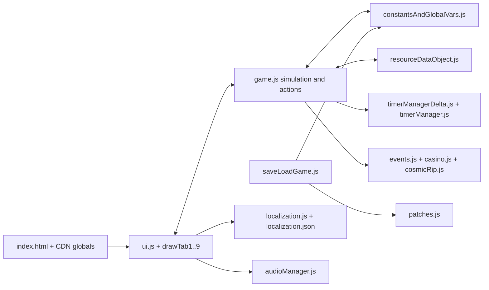

# Architecture and code inventory

## Runtime shape

The F-01–F-03 source lock, nine-tab/pane inventory and root-module ownership map are recorded in the [foundation source contract](foundation-source-contract.md). Domain details are in the [economy](foundation-economy.md), [space/interstellar](foundation-space.md) and [meta/endgame](foundation-meta.md) catalogues.

Cosmic Forge is an HTML/CSS/ES-module application with an optional Electron shell. [index.html](../../../cosmicForge/cosmicForge/index.html) loads CDN scripts for jQuery, Popper, Bootstrap, LZString and CryptoJS, then `buildFlags.js`, then [ui.js](../../../cosmicForge/cosmicForge/ui.js) as a module. [main.js](../../../cosmicForge/cosmicForge/main.js) creates a fullscreen Electron `BrowserWindow` that loads the same HTML. A separate static server and Python packaging script support browser distribution. There is no bundler in the interactive app path.

The module graph is tightly coupled: `ui.js` imports game/state functions; [game.js](../../../cosmicForge/cosmicForge/game.js) imports UI and data functions; [resourceDataObject.js](../../../cosmicForge/cosmicForge/resourceDataObject.js) imports game functions as well as save migrations; [constantsAndGlobalVars.js](../../../cosmicForge/cosmicForge/constantsAndGlobalVars.js) holds mutable state and restoration logic. This makes change impact hard to reason about and complicates isolated tests.

## Responsibility map

| Source | Current role | Remake consequence |
|---|---|---|
| `index.html`, `styles.css` | Nine-tab shell, dialogs, debug windows, themes, layout | Preserve navigation and information; rebuild responsive, accessible shell. |
| `ui.js`, `drawTab1Content.js` through `drawTab9Content.js`, `descriptions.js` | Event wiring, pane creation, controls, dynamic descriptions, notifications, visual map/cinematics | Extract view models and content. Do not make the DOM an economic data source. |
| `game.js` | Frame loop, purchase/gain logic, production, energy, research, stars, travel, battles, rebirth | Split into rules and domain services with explicit state transitions. |
| `resourceDataObject.js` | Initial content and mutable stores for resources, upgrades, stars, casino, market, buffs, achievements | Separate immutable catalogue from per-save state. |
| `constantsAndGlobalVars.js` | Constants, flags, globals, save snapshot/restore, cross-run state | Make state schema and reset ownership explicit. |
| `timerManagerDelta.js`, `timerManager.js` | Simulation delta timers and wall-clock timers | Define one clock abstraction, including offline and time warp behavior. |
| `precision.js` | Shared affordability/settlement/display policy | Retain the invariants, port to typed pure functions. |
| `saveLoadGame.js`, `patches.js` | Cloud/local saves, import/export, historical schema migration | Version and validate MIAPLACIDUS saves; original-game import is excluded by the product decision. |
| `localization.js`, `localization.json`, `validateLocalization.cjs` | Language resolution, translation lookup, catalogue gate | Preserve six-language coverage and build-time checks; add typed keys and safe rich text. |
| `events.js`, `casino.js`, `cosmicRip.js`, `achievements.js`, `onboarding.js` | Major independent rules and progression subsystems | Port contracts by feature with deterministic tests. |
| `audioManager.js`, `analytics.js` | Sound/ambience and optional analytics | Rebuild audio with new assets; omit analytics entirely. |
| `create_build.py`, `tools/build-*`, `main.js` | Web/itch and Electron release paths | Rebuild only the browser distribution path for desktop and responsive mobile. |

## State and update flow

The game starts from large mutable module objects. The loop in [game.js](../../../cosmicForge/cosmicForge/game.js) calls `timerManagerDelta.updateWithTimestamp(...)`, many feature-specific `*Checks()` functions, and schedules another `requestAnimationFrame`. Purchases mutate shared stores, redraw panes, and update DOM fragments. Some checks read rendered HTML/text as the source for subsequent formatting or decisions. A previous [UI refactor audit](../../../cosmicForge/cosmicForge/docs/largeUIRefactor.md) documents specific DOM-as-state and per-frame scan sites; current `game.js` and `ui.js` still contain the corresponding patterns. This is the largest architectural boundary to replace.

There are at least two time domains: delta simulation timers and wall-clock UI/news scheduling. They interact with black-hole time warp, offline gains, autosave, travel, and casino timer prizes. A remake clock needs explicit rules about what advances when the page is hidden, offline, paused, or accelerated.

## UI and rendering surface

Current [index.html](../../../cosmicForge/cosmicForge/index.html) defines nine tab containers. `ui.js` binds menu rows by `tabN.optionM` class token; the corresponding `drawTabNContent.js` reconstructs a pane. Some later panes also use `data-option-pane` identifiers. This hybrid is why tests enumerate real menu tokens and why a translated label must never be used as the identity of a pane. The old [large UI refactor plan](../../../cosmicForge/cosmicForge/docs/largeUIRefactor.md) identifies individually sized rows, full pane rebuilds, sparse responsive rules, and uneven theme tokens. Treat its line numbers and counts as historical; use current source before acting on each one.

## Content and dependencies

Assets are sizable: 809 images and 30 sounds were counted in the active source tree. The [build guide](../../../cosmicForge/cosmicForge/docs/making-a-build.md) describes separate Python web/itch and Electron pipelines, and [package.json](../../../cosmicForge/cosmicForge/package.json) includes several packages related to the old test/build stack. The HTML also loads runtime libraries from CDNs. MIAPLACIDUS should inventory assets for coverage, remake all visual files, and bundle its runtime dependencies locally. The project owner later authorized unchanged reuse of all 30 MP3s; their provenance is in the [asset manifest](../plans/miaplacidus-asset-manifest.md).

The reference [LICENSE](../../../cosmicForge/cosmicForge/LICENSE) contains GPLv3. Before copying any source text or data verbatim, confirm authorship and distribution terms. Source images and video remain reference material only. The owner explicitly authorized the 30 source MP3 files for unchanged reuse on 2026-10-04; the remake records them individually in its asset manifest.
