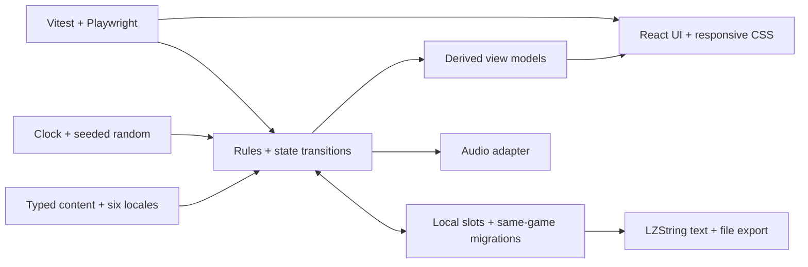

# MIAPLACIDUS rebuild roadmap

The [master build checklist](master-checklist.md) is the **only project control checklist**. This roadmap explains sequence and architecture; each linked work package contains granular tasks. The [decision record](open-decisions.md) fixes the product scope, and the [local save contract](local-save-contract.md) fixes startup and persistence behavior.

## Goal and constraints

Rebuild the shipped Cosmic Forge game from scratch as **MIAPLACIDUS** at comparable gameplay scale, with smoother UI and maintainable code. Preserve nine tabs, the full progression and endings, six languages, themes, achievements, events, audio and offline play. Make all art and sound anew. Deliver a browser game for desktop and responsive mobile. Local multiple saves and LZString text/file exchange replace cloud saving; only saves created in MIAPLACIDUS enter this game's future migration ladder. No Electron or analytics. The full game is the default build; an optional demo is behind an explicit flag. Balance may improve after source behavior and the intentional delta are recorded.

## Working architecture

Use **TypeScript + Vite + React** with semantic HTML and responsive CSS. React renders and handles interactions; it does not own the simulation clock or thousands of mutable gameplay values. A framework-independent engine owns typed state, immutable content catalogues, deterministic commands, selectors, one clock, seeded randomness, timers and reset scopes. A storage boundary owns versioned multi-slot `localStorage` saves, validation, same-game migrations and portable LZString formats. UI subscribes to derived snapshots at a controlled cadence. Audio is an optional effect adapter; gameplay runs when audio is unavailable.

The Vite/React/TypeScript stack and deterministic engine substrate are implemented. The [Vite guide](https://vite.dev/guide/), [React TypeScript guide](https://react.dev/learn/typescript), [Playwright TypeScript guide](https://playwright.dev/docs/test-typescript) and [Vitest guide](https://vitest.dev/guide/) remain implementation references for the outstanding UI and harness tasks.

## Delivery sequence

**Current progress (2 October 2026):** M-01 is complete. F-01–F-10 source inspection and extraction are recorded against the frozen reference; F-11–F-18 provide the browser/toolchain scaffold; F-19–F-30 provide the scoped state and engine/simulation contracts; F-31–F-42 deliver and verify the Hydrogen-only vertical slice. See the [M-01 completion record](../archive/plans/2026-10-02-hydrogen-vertical-slice.md). M-02, local saves and confirmed-name loading, is the next gate; broader gameplay areas remain open.

| Stage | Work package | Playable or reviewable milestone |
|---|---|---|
| 1 | [Foundation and extraction](build-checklist/01-foundation.md) | Reference contracts, deterministic engine, nine-tab shell, Hydrogen slice and first focused tests |
| 2 | [Local saves and startup](build-checklist/02-local-saves.md) | Two pioneers with independent progress, confirmed-name Start, export/import and recovery |
| 3 | [Economy and research](build-checklist/03-economy.md) | Complete resource, power, research, technology and compound loop |
| 4 | [Space and interstellar](build-checklist/04-space-interstellar.md) | Mining, antimatter, map, starship, diplomacy, fleet, battle and settlement |
| 5 | [Meta progression and endgame](build-checklist/05-meta-endgame.md) | Rebirth, market/casino, philosophies, black hole, megastructures and Cosmic Rip closure |
| Cross-phase | [Presentation and localization](build-checklist/06-presentation.md) | Nine complete tabs, new art/sound, responsive interaction, themes and six locales |
| 7 | [Verification and release](build-checklist/07-verification-release.md) | Current parity evidence, safe browser artifact and optional separately flagged demo |

For each domain, create a small contract with source references, data/state ownership, invariant, UI behavior, failure modes, save/rebirth impact and tests. Build it as a playable vertical slice, run focused checks and record evidence in the [parity ledger](feature-parity-checklist.md). A green old-project test never counts as a new-project pass. Completed feature plans may be archived in `docs/archive/plans/` with their final decisions and evidence.
